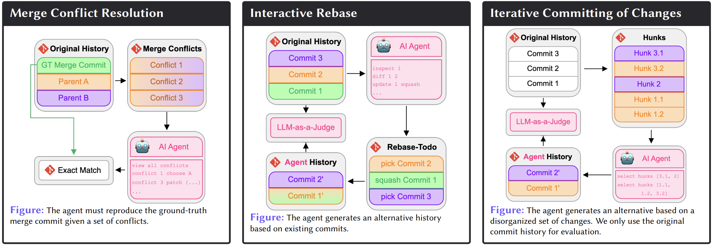

[]()

# GitGoodBench


In this repository we release the code accompanying our paper "GitGoodBench: A Novel Benchmark For Evaluating Agentic Performance
On Git" published at the 1st Workshop for Research on Agent Language Models (REALM 2025), co-located with ACL 2025 in Vienna. We release the benchmark suite we present in the paper on HuggingFace. There you can also find a detailed dataset card:
- [GitGoodBench](https://huggingface.co/datasets/JetBrains/git_good_bench)
- [GitGoodBench Lite](https://huggingface.co/datasets/JetBrains/git_good_bench-lite)
- [GitGoodBench Train](https://huggingface.co/datasets/JetBrains/git_good_bench-train)

For details on the construction of our dataset and supported scenarios, we refer the to our paper.

## Scraping Repositories
You can use the `RepositoryDataScraper` to scrape your own repository or extend it
to mine additional scenarios for AI Agents. In either case, follow the setup instructions in this section to
setup and run the system locally.

To simply run the tests, please first unzip the repositories for testing that we provide in `repos/testing-repositories.zip`
into the `repos` folder. The repositories for testing should then be located under `repos/testing-repositories`.

Then install the requirements in the requirements file corresponding to your OS with pip. The entrypoint for running the 
repository data scraper locally is `src/repository_data_scraper/main.py`. This implementation supports local concurrency. 
However, because we require access to the Git history of a repository, each repository must also be cloned which may take 
some time depending on your internet connection. Furthermore, local concurrency is typically heavily limited by the number of 
available cores. Thus we only recommend using the local implementation for prototyping

For actually mining repositories at scale, we recommend using a Map-Reduce platform. We used YTsaurus and a our
implementation of this can be found at `src/data_processing_scripts/mappers.py` and `src/data_processing_scripts/yt_maintenance_util.py`,
in the `RepositoryDataMapper` class and `run_repository_data_mapper` function respectively.

## Benchmark Creation
We note that the implementation of our data scraper does not result in our benchmark right away. During the development
of our benchmark, we applied further preprocessing steps to the output of the repository data scraper. All major preprocessing
steps we used are available in the `src/data_processing_scripts/mappers.py` file.

Furthermore, the stratification procedure we use to create our dataset splits is implemented in `src/data_processing_scripts/downsample_dataset.py`

## Baseline Implementation
In `src/agent_client` we release an open source version of our baseline implementation for documentation purposes. Note that 
the released version is not runnable, as we had to remove proprietary code. However, it contains all tool implementations, 
our scenario environment management and evaluation implementation in addition to the prompts and context provided.

## Baseline Results
Finally, in `src/notebooks` we provide the Jupyter notebooks in which we analyzed our benchmark, computed the statistics
presented in the HuggingFace dataset cards and our main results. 

In the `data` folder we release an SQLLite DB (`data/vcs-agent-evaluation-metadata.db`) containing the results of the evaluation run with our baseline on GitGoodBench Lite and the data on the original repositories we considered before any preprocessing.

## Citation

If you found this software useful, used our datasets, or were inspired by our work or paper, please cite:

```bibtex
@inproceedings{lindenbauer-etal-2025-gitgoodbench,
    title = "{G}it{G}ood{B}ench: A Novel Benchmark For Evaluating Agentic Performance On Git",
    author = "Lindenbauer, Tobias  and
      Bogomolov, Egor  and
      Zharov, Yaroslav",
    editor = "Kamalloo, Ehsan  and
      Gontier, Nicolas  and
      Lu, Xing Han  and
      Dziri, Nouha  and
      Murty, Shikhar  and
      Lacoste, Alexandre",
    booktitle = "Proceedings of the 1st Workshop for Research on Agent Language Models (REALM 2025)",
    month = jul,
    year = "2025",
    address = "Vienna, Austria",
    publisher = "Association for Computational Linguistics",
    url = "https://aclanthology.org/2025.realm-1.19/",
    doi = "10.18653/v1/2025.realm-1.19",
    pages = "272--288",
    ISBN = "979-8-89176-264-0",
    abstract = "Benchmarks for Software Engineering (SE) AI agents, most notably SWE-bench, have catalyzed progress in programming capabilities of AI agents. However, they overlook critical developer workflows such as Version Control System (VCS) operations. To address this issue, we present GitGoodBench, a novel benchmark for evaluating AI agent performance on Version Control System (VCS) tasks. GitGoodBench covers three core Git scenarios extracted from permissive open-source Python, Java, and Kotlin repositories. Our benchmark provides three datasets: a comprehensive evaluation suite (900 samples), a rapid prototyping version (120 samples), and a training corpus (17,469 samples). We establish baseline performance on the prototyping version of our benchmark using GPT-4o equipped with custom tools, achieving a 21.11{\%} solve rate overall. We expect GitGoodBench to serve as a crucial stepping stone toward truly comprehensive SE agents that go beyond mere programming."
}
```

